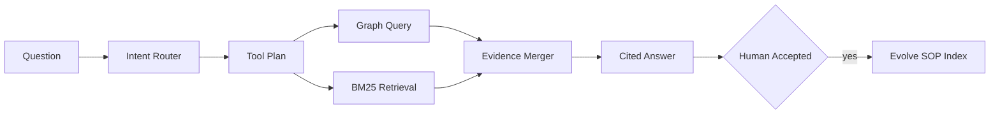

# Graph SOP Agent

A hybrid structured/unstructured SOP assistant with intent routing, graph traversal, BM25 retrieval, parallel tool execution, citations, and verified knowledge evolution.

This repository implements an original, laptop-scale reference system for a
production problem that repeatedly appears in strong AI/ML/software-engineering
portfolios. It focuses on architecture, failure handling, evaluation, and
reproducibility instead of claiming access to proprietary infrastructure.

## What is implemented

- Typed entity graph with schema-constrained traversal
- BM25-style retrieval over unstructured SOP sections
- Intent classification and deterministic tool planning
- Parallel graph and document retrieval with merged evidence
- Human-approved trace-to-SOP ingestion with provenance

## Architecture



## Quick start

```bash
python -m venv .venv
source .venv/bin/activate
python -m pip install -e .
python -m unittest discover -s tests -v
PYTHONPATH=src python src/graph_sop_agent/core.py
```

The demo prints a self-contained JSON report from seeded synthetic fixtures;
wall-clock latency values are machine-dependent. It is safe to run offline and
does not require credentials, paid APIs, GPUs, or employer data.

## Evaluation contract

The included logistics fixtures test intent accuracy, graph-path correctness, lexical retrieval, citation completeness, and whether rejected traces are prevented from mutating the knowledge base.

## Repository layout

- `src/graph_sop_agent/core.py` - executable reference implementation
- `tests/test_core.py` - deterministic regression and failure-path tests
- `benchmark-report.json` - checked-in output from the deterministic demo
- `.github/workflows/ci.yml` - clean-install CI on Python 3.12

## Scope and provenance

The problem definition was inspired by recurring engineering patterns observed
while reviewing a large resume corpus. All naming, source code, fixtures, and
documentation in this repository are original. Reported demo numbers are local
synthetic measurements, not production claims. The system is intentionally
compact so reviewers can inspect every design decision.

## License

MIT
